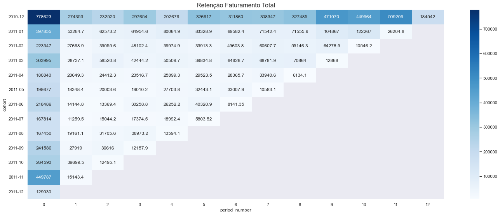

# Projeto Análise de Cohort UK E-commerce

## O projeto

Este projeto que compõe o meu portfólio profissional busca realizar uma análise de retenção de clientes utilizando Cohort em um conjunto de dados disponibilizado por uma rede de e-commerce do Reino Unido. Convém mencionar que o dataset possui informações de milhares de faturas fiscais emitidas no período de dezembro de 2010 a dezembro de 2011.

O projeto está estruturado nos seguintes passos:

1. Questão de negócio
2. Premissas do projeto
3. Planejamento da solução
4. Análise e resultados obtidos
5. Conclusão do projeto
6. Próximos passos

## 1 Questão de negócio

Retenção de clientes é o nome dado à capacidade de manter clientes fiéis, que continuam fazendo negócios com uma empresa, ao longo do tempo. De maneira geral, quanto mais tempo um cliente permanece dentro de uma empresa, mais lucro ele gera para este negócio. Além disso, no processo de captação de clientes é realizado um investimento para conquista-lo e o que também demanda um certo tempo para recuperar esse recurso financeiro. A análise de retenção foca no comportamento do cliente enquanto ele se encontra dentro do negócio com objetivo de fazer com que a experiência atenda as suas expectativas evitando assim a saída do cliente da empresa.

### 1.1 O que é uma análise de Cohort
Cohort é o nome dado a um agrupamento de clientes com uma característica em comum dentro de uma linha de tempo. Por exemplo, 20 clientes entraram no mês de outubro na base de clientes e outros 13 entraram no mês de dezembro. Nesse caso, poderíamos entender que os 20 clientes de outubro são um cohort e os outros 13 são outro cohort, cada agrupamento iniciou a sua relação com a empresa em um momento distinto do negócio. Diante disso, entender o comportamento desses diversos cliente ao longo da linha do tempo do negócio é fundamental para que medidas possam ser tomadas para que esses clientes com diferentes experiências possam permanecer no negócio.

Cada Cohort pode ser analisado com uma métrica de interesse, como por exemplo o faturamento médio ao longo de um intervalo de tempo.O cohort difere de um segmento de usuários comum, pois, neste último, é possível criar conjuntos com praticamente qualquer condição como base, não precisando se basear em tempos e eventos em comum.

### 1.2 Qual o problema de negócio?
Neste projeto fui contratado como Cientista de Dados para explorar os dados e trazer repostas sobre qual foi o comportamento do clientes dentro da rede de e-commerce no período de dezembro de 2010 a dezembro de 2011. O time de negócio da empresa acredita que há muitas informações valiosas armazenas nos dados das faturas fiscais, que ainda não foram explorados. Diante disso, os mesmos desejam explorar e encontrar respostas para validar ou refutar novas hipóteses de negócio para que os clientes possam comprar mais e continuarem fieis a empresa. Diante desse cenário fui designado a realizar um análise de cohort nas faturas fiscais do período.

### 1.3 O conjunto de dados
O conjunto de dados transacional contém todas as transações ocorridas entre 01/12/2010 e 09/12/2011 de uma rede de e-commerce do Reino Unido. A empresa comercializa principalmente presentes exclusivos para todas as ocasiões. Ressalta-se que muitos clientes da empresa são atacadistas. O dataset do projeto corresponde ao ["E-Commerce Data"](https://www.kaggle.com/datasets/carrie1/ecommerce-data?select=data.csv) existente na plataforma do Kaggle Inc. Ressalta-se que esse dataset tem informações de 25 mil faturas fiscais unicas realizadas no período.

Cada fatura do conjunto de dados possui as seguintes informações:
1. "invoice_No - Número da faturamento
2. StockCode - Código de cada produto
3. Description" - Descrição do produto
4. "Quantity" - Quantidade unitária de cada produto
5. "InvoiceDate" - Data e horário da faturamento
6. "UnitPrice" - Preço unitário de cada produto
7. "CustomerId" - Identificador do cliente
8. "Country" - País de origem do cliente

Ressalta-se que cada fatura sintetiza todas as quantidades e produtos comprados em uma determinada compra realizada por um cliente em um determinado dia e horário. Ao todo o dataset possui mais de 542 mil linhas e 8 colunas.

## 2 Premissas do projeto

Para a análise de cohort deste projeto foi considerado que a entrada do cliente no negócio será a data registrada na primeira fatura emitida para o "customer_id" no período do dataset. Por exemplo, o customer_id que tem registrado a sua primeira compra em 25/03/2011 será considerado como um cliente do Cohort do mês de março de 2011. Não é possível verificar se esses customer_id já realizaram outras compras em períodos anteriores a 01/12/2010.

No dataset a variável "customer_id" possui cerca de 25% de dados faltantes, porém as demais colunas associadas a esses dados faltantes possuem informações que são possíveis de serem análisadas. Para esses casos consideraremos esses customer_id como novos clientes, uma vez que não é possível saber se esses Na's são de clientes já identificados nesse dataset.

Nesse primeiro ciclo do CRISP, somente foram utilizadas as faturas com quantidades positivas na análise de Cohort. Ressalta-se que não foram analisadas as faturas com quantidades negativas, as quais correspondem as faturas de devoluções. Para a variável "Country" não vamos utilizar os paises "Unspecified" e "European Community" devido a falta de especificação.

## 3 Planejamento da solução

### 3.1 Produto proposto

Elaboração de diversos gráficos de Cohorts elaborados a partir do conjunto de dados tendo como objetivo realizar uma análise de retenção de clientes.

### 3.2 Ferramentas utilizadas

* Python Packages
* Jupyter notebook

<table>
  <tbody>
    <tr valign="top">
      <td width="25%" align="center">
        Python  
        
      </td>
      <td width="25%" align="center">
        pandas  
        
      </td>
      <td width="25%" align="center">
        NumPy  
        
      </td>
      <td width="25%" align="center">
        SciPy  
        
      </td>
    </tr>
      <tr valign="top">
      <td width="25%" align="center">
        Matplotlib  
        
      </td>
      <td width="25%" align="center">
        seaborn  
        
      </td>
      <td width="25%" align="center">
        Jupyter  
        
      </td>
  <tbody>  
<table>

### 3.3 Processo

Ao todo a execução da solução do projeto será dividida em 4 passos:

1 Coleta e Descrição dos dados
2 Filtragem dos dados
3 Feature engineering
4 Análise de Cohort

## 4 Análise e resultados obtidos

Foram elaborados os Cohorts:
* Retenção de Clientes
* Retenção de Clientes em porcentagem
* Retenção Faturamento Total em porcentagem
* Faturamento Médio Produto
* Faturamento Mediano produto
* Tipos de produtos
* Média de Itens da Cesta
* Cohorts - Horários de maiores volumes de compras

### 4.1 Cohorts

**Retenção de Clientes**

Cohort 2010-12 - Linha 1
* No mês de dezembro de 2010 ao todo 1041 clientes realizaram a sua primeira compra no e-commerce. ( Linha 1 x Coluna 0 )
* No mês de janeiro de 2011 apenas 323 dos 1041 clientes voltaram a comprar novamente algum produto nesse mês ( Linha 1 x Coluna 1 )
* O cliente que entrou nesse cohort permanece sendo analisado por 12 meses até dezembro de 2011.

Cohort 2011-10 - Linha 11
* No mês de outubro de 2011 ao todo 459 clientes realizaram a sua primeira compra no e-commerce. ( Linha 11 x Coluna 0 )
* No mês de dezembro de 2011 apenas 41 dos 459 clientes voltaram a comprar novamente algum produto nesse mês ( Linha 11 x Coluna 2 )
* O cliente que entrou nesse cohort permanece sendo analisado por 2 meses até dezembro de 2011.

Insights
* As vendas caem cerca de 50% depois do cohort de 2010-12
* Os piores cohorts com menos entrada de novos clientes foram agosto (2011-08) e dezembro (2011-12) de 2011.

**Retenção de Clientes em porcentagem**

Cohort 2010-12 - Linha 1
* No mês de dezembro de 2010 ao todo 1041 clientes realizaram a sua primeira compra no e-commerce e correspondem a 100% do Cohort. ( Linha 1 x Coluna 0 )
* No mês de janeiro de 2011 apenas 31% dos clientes voltaram a comprar novamente algum produto nesse mês ( Linha 1 x Coluna 1 )
* O cliente que entrou nesse cohort permanece sendo analisado por 12 meses até dezembro de 2011.

Cohort 2011-10 - Linha 11
* No mês de outubro de 2011 ao todo 459 clientes realizaram a sua primeira compra no e-commerce e correspondem a 100% do Cohort. ( Linha 11 x Coluna 0 )
* No mês de dezembro de 2011 apenas 19% dos clientes voltaram a comprar novamente algum produto nesse mês ( Linha 11 x Coluna 2 )
* O cliente que entrou nesse cohort permanece sendo analisado por 2 meses até dezembro de 2011.

Insights
* O cohort de 2010-12 apresenta a melhor taxa de retenção de clientes ao longo dos meses
* Os piores cohorts com menores taxas de retenção de clientes foram o de julho(2011-07) e novembro (2011-11) de 2011.

**Faturamento total**

Cohort 2010-12 - Linha 1
* No mês de dezembro de 2010 ao todo 1041 clientes realizaram a sua primeira compra, o que gerou o faturametno total de $778623. ( Linha 1 x Coluna 0 )
* No mês de novembro de 2011, 43% dos clientes voltaram a comprar novamente e faturaram $509209 ( Linha 1 x Coluna 1 )
* O cliente que entrou nesse cohort permanece sendo analisado por 12 meses até dezembro de 2011.

Cohort 2011-08 - Linha 09
* No mês de agosto de 2011 ao todo 241 clientes realizaram a sua primeira compra, o que gerou o faturamento de $167450 . ( Linha 9 x Coluna 0 )
* No mês de dezembro de 2011 apenas 19% dos clientes voltaram a comprar novamente algum produto nesse mês ( Linha 11 x Coluna 2 )
* O cliente que entrou nesse cohort permanece sendo analisado por 4 meses até dezembro de 2011.

Insights
* O cohort de 2010-12 apresenta o melhor mês onde os clientes gastaram mais comparando com os demais meses.
* O cohort de 2011-11 apresenta o segundo melhor mês onde os clientes gastaram mais comparando com os demais meses.
* Os piores cohorts em termos de volume de faturamento total correspondem a julho(2011-07) e agosto (2011-08) de 2011.

**Faturamento total em porcentagem**

Cohort 2010-12 - Linha 1
* No mês de dezembro de 2010 ao todo 1041 clientes realizaram a sua primeira compra no e-commerce e correspondem a 100% do Cohort. ( Linha 1 x Coluna 0 )
* No mês de abril de 2011 o volume total de vendas correspondeu a 26% do volume total do cohort ( Linha 1 x Coluna 4 )
* O cliente que entrou nesse cohort permanece sendo analisado por 12 meses até dezembro de 2011.

Cohort 2011-06 - Linha 7
* No mês de julho de 2011 o volume total gasto pelos 42 clientes que voltaram comprar representou 6 % do volume total do cohort. ( Linha 7 x Coluna 1 )
* No mês de agosto de 2011 o volume total gasto pelos 36 clientes que voltaram comprar representou 6 % do volume total do cohort. ( Linha 7 x Coluna 2 )
* O cliente que entrou nesse cohort permanece sendo analisado por 6 meses até dezembro de 2011.

Insights
* O cohort de 2010-12 apresenta a melhor taxa de faturamento de clientes ao longo dos meses.
* O mês de novembro de 2011 do cohort 2010-12 apresentou um volume de faturamento de 65 % comparado com faturamento total do cohort.( Linha 1 x Coluna 11 )

**Faturamento médio produto**

Cohort 2010-12 - Linha 1
* No mês de outubro de 2011 330 clientes do cohort tiveram um ticket médio por produto de $33.31 gerando um faturamento de $449964. ( Linha 1 x Coluna 10 )

Cohort 2011-01 - Linha 2
* Após os 3  primeiros períodos iniciais o ticket médio por produto desse cohort foi maior comparado com os demais cohorts . ( Linha 2 x Coluna 3 )

Insights
* O cohort de 2010-12 apresenta o melhor mês onde os clientes gastaram mais em média comparando com os demais meses.
* O cohort de 2011-11 apresentou os menores tickets médio por produto( Linha 12  )

**Faturamento mediano produto**

Cohort 2011-05 - Linha 6
* No mês de agosto de 2011 o ticket mediano por produto foi o maior comparado com os demais cohorts após 3 períodos. ( Linha 6 x Coluna 3 )

Cohort 2011-07 - Linha 08
* O cohort de julho de 2011 possui o menor ticket mediano para os novos clientes, que corresponde a $4.96. ( Linha 8 x Coluna 0 )

Insights
* Os tickets medianos apresentam valores bem menores que os tickets médios por produtos.
* O cohort de julho de 2011 possui os menores tickets medianos comparado aos demais cohorts.

**Tipos de produtos**

Cohort 2010-12 - Linha 1
* No mês de dezembro de 2010 os 1041 clientes compraram ao todo 2783 tipos diferentes de produtos. ( Linha 1 x Coluna 0 )

Cohort 2011-07 - Linha 8
* No mês de agosto de 2011 apenas 400 tipos diferentes de produtos foram comprados pelos 315 clientes que compraram nesse cohort. ( Linha 8 x Coluna 1 )

Cohort 2011-02 - Linha 3
* No mês de dezembro de 2011 apenas 332 tipos diferentes de produtos foram comprados pelos 481 clientes que compraram nesse cohort. ( Linha 3 x Coluna 10 )

Insight
* O cohort de 2010-12 apresenta o melhor mês onde os clientes compraram mais tipos de produtos.

**Média de itens na cesta**

Cohort 2010-12 - Linha 1
* No mês de dezembro de 2010 a quantidade média de itens na cesta dos 1041 clientes corresponde a 8.68 itens. ( Linha 1 x Coluna 0 )

Cohort 2011-02 - Linha 3
* No mês de abril de 2011 a quantidade média de itens na cesta dos 481 clientes desse cohort corresponde a 19.07 itens. ( Linha 3 x Coluna 2 )

Cohort 2011-01 - Linha 2
* A quantidade média de itens na cesta  dos primerios clientes desse cohort foi superior aos demais cohorts. ( Linha 2 x Coluna 0 )

### 4.2 Cohorts - Horários de maiores volumes de vendas

**Horários de maiores volumes de vendas**

As compras realizadas de 12:00 às 15:59 correspondem a 54.79% do volume total

**Retenção de Clientes**

**Retenção de Clientes em porcentagem**

**Faturamento total**

**Faturamento total em porcentagem**

**Faturamento médio produto**

**Faturamento mediano produto**

**Tipos de produtos**

**Média de itens na cesta**

## 5. Conclusão do projeto

O presente projeto de estudo cumpriu o seus objetivos e após todo o desenvolvimento foi possível elaborar a análise de cohort no conjunto de dados. Além disso, o notebook com todo processo de construção da solução também encontra-se disponível no presente repositório. Vale mencionar que o emprego da técnica de análise de cohort é fundamental no contexto de resolução de problemas de negócio envolvendo ciência de dados.

## 6. Próximos passos

Ressalta-se que após a finalização desse projeto de estudo é possível seguir por vários caminhos distintos.Geralmente essa decisão poderá ser pautada por novas demandas vinda do CEO ou em função da motivação da equipe de ciência de dados. Essa decisão se dá em função dos vários tipos de análises que podem ser realizadas com os dados, entre as quais destacamos:

**Elaborar Cohorts com novas métricas**
* Recência entre as compras dos Clientes
* Produtos retornados pelos clientes
* Explorar outros hórarios
* Explorar os clientes pelos países
* Análisar Feature “description” em busca de padrões e categorias

**Projetos**
* Projeto de Clusterização
* Projeto de previsão de vendas
* Projeto de classificação
* Projeto de análise exploratória de dados

### Autor

Deivison Morais. Visite o meu portfólio de projetos [aqui.](https://deivison1983.github.io/portfolio_projetos/)

### Contatos

  
  

